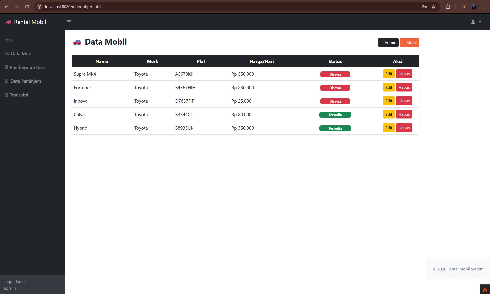
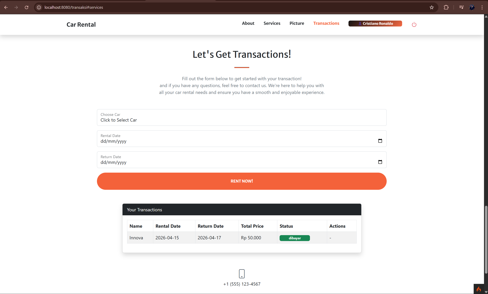

# 🚗 Car Rental Management System

## 📖 Description

A web-based car rental system built using CodeIgniter.  
This application supports two roles: **Admin** and **Customer**, with features for managing cars, transactions, and payments.

---

## 👥 User Roles

### 🔐 Admin

- Manage car data (add, edit, delete)
- View user payments
- Manage borrowers data
- Monitor transactions

### 👤 Customer

- Browse available cars
- Select rental date
- Make transactions
- Complete payment

---

## 🚀 Features

### 🚗 Car Management

- Add new car
- Edit car details (name, brand, plate, price, status)
- Delete car

---

### 💳 Payment System

- Multiple payment methods:
  - Cash
  - Bank Transfer
  - Courier
- Automatic payment status update

---

### 🔄 Transaction Flow

1. User selects available car
2. User chooses rental & return date
3. System calculates total price
4. User confirms rental
5. User completes payment

---

## 🧠 Example Case

- Car: Toyota Innova
- Price: Rp25.000/day
- Rental: 15 → 17

Total:

2 days × Rp25.000 = Rp50.000

---

---

## 🛠️ Tech Stack

- PHP (CodeIgniter 4)
- MySQL
- HTML, CSS, JavaScript

---

## ⚙️ Installation

```bash
git clone https://github.com/abereborn/car-rental-management-system-ci4.git
cd car-rental-management-system-ci4
composer install
```

### Setup

- Copy .env.example → .env
- Configure database
- Run via Laragon / localhost

### 📸 Screenshots

- Landing page
  

- Admin Dashboard
  

-Transaction page


### 👨‍💻 Author

Affan Baihaqi
